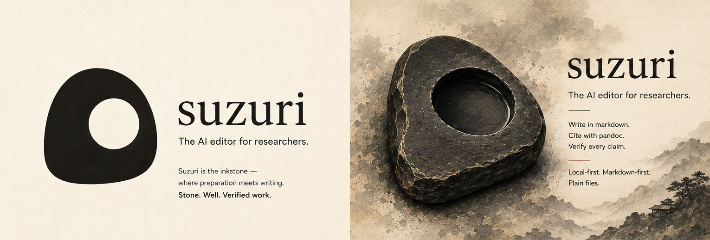

# Grinding the ink

Water, **a few drops** at a time, then a slow circular grind. The stone
decides how dark the ink gets — see [[inkstone-care]] for the whole ritual.

Density follows [@tanaka2019, p. 41] — ratios live in [[duan-ratios]], and it saturates near $t^* \approx 4$ min:

$$D(t) = D_{\max}\left(1 - e^{-t/\tau}\right)$$

| stone   | origin      | year | grind |
| ------- | ----------- | ---- | ----- |
| Duan    | Guangdong   | 1782 | slow  |
| She     | Anhui       | 1甲  | fine  |

- [x] Photograph the well before it dries
- [ ] Weigh the stick after twelve minutes

Rendering is verified surface by surface: tables in [[table-rendering-check]], math in [[math-rendering-check]], mermaid diagrams in [[mermaid-rendering-check]], callouts in [[callout-rendering-check]], highlights and tags and footnotes in [[inline-rendering-check]], transclusion in [[embed-rendering-check]], the Properties card in [[frontmatter-rendering-check]], block-edge editing in [[block-interaction-check]], and image reloading in [[image-reload-check]].

*Notes continue in [[reading-list]].*
