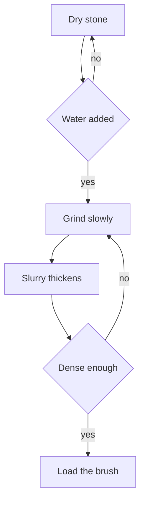
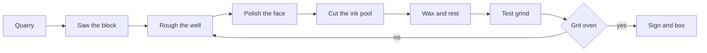
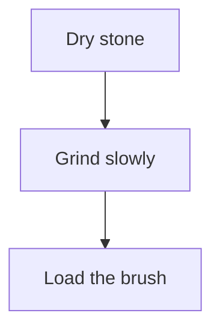
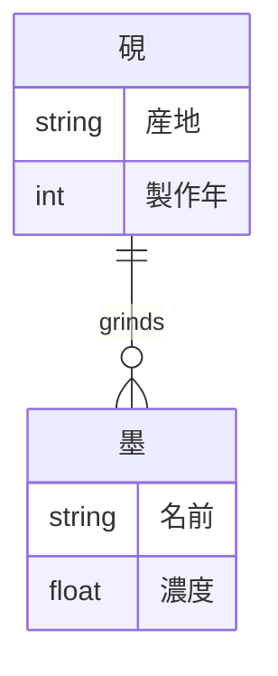
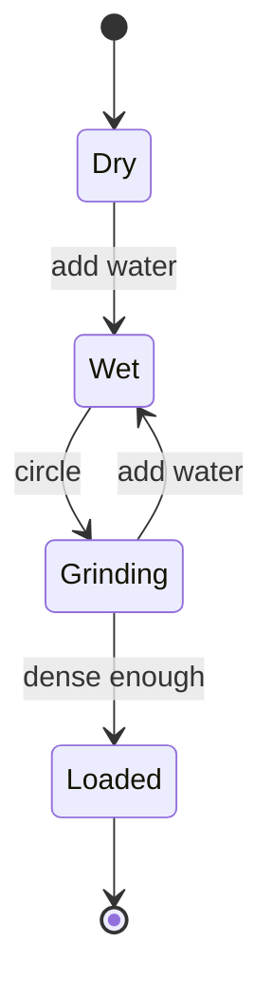
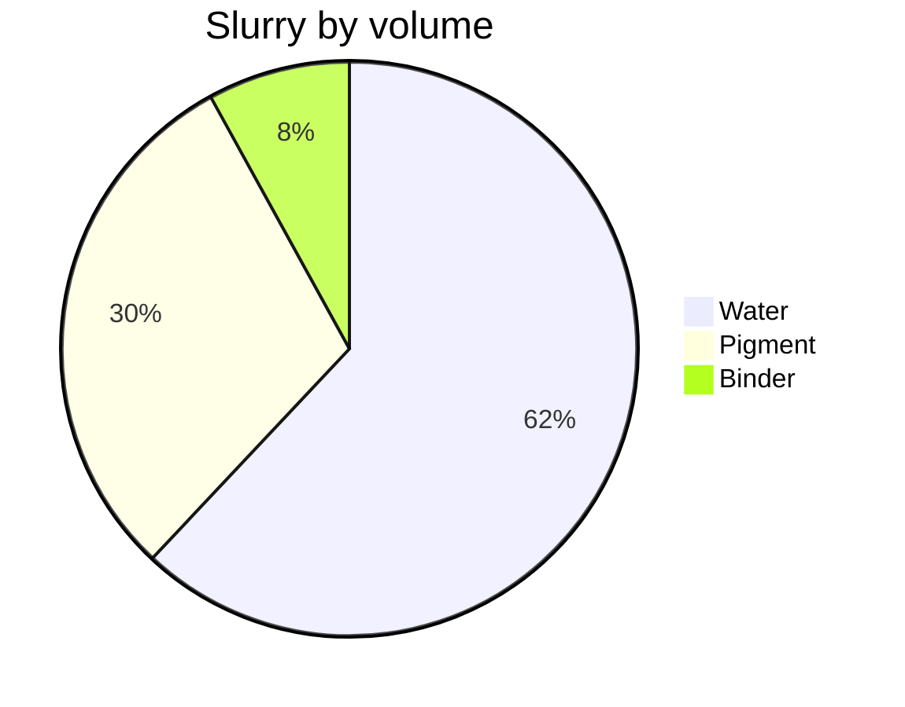
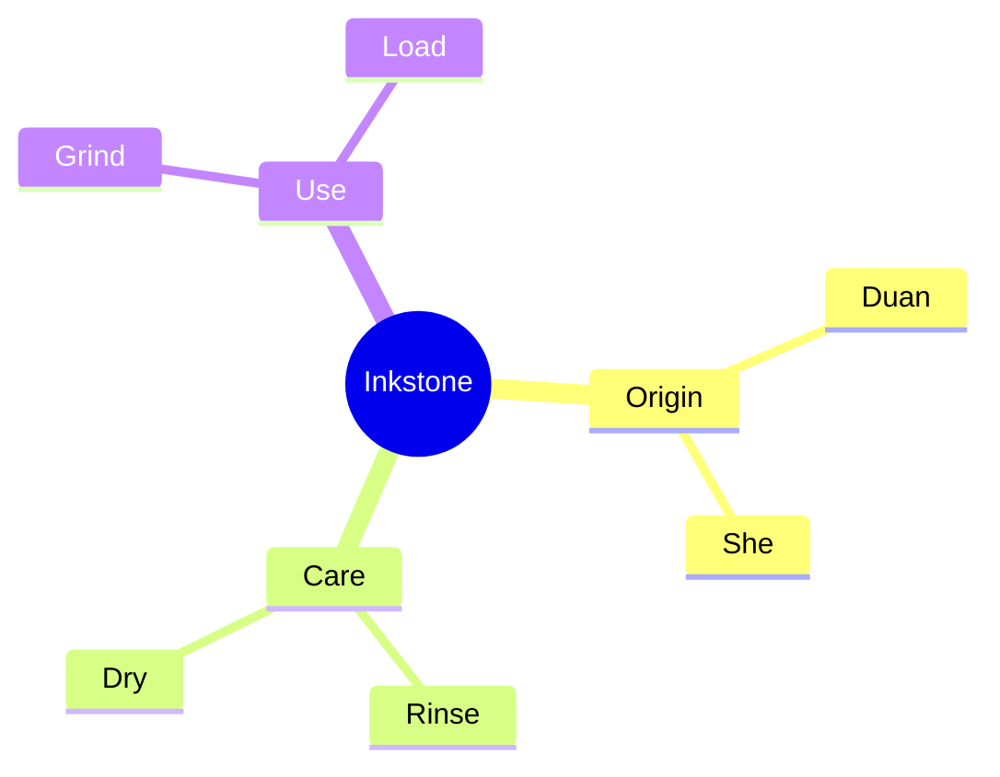
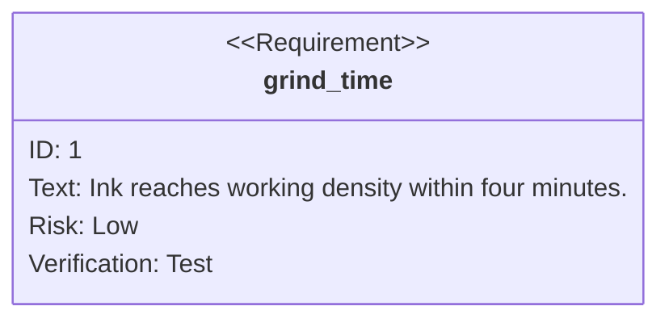
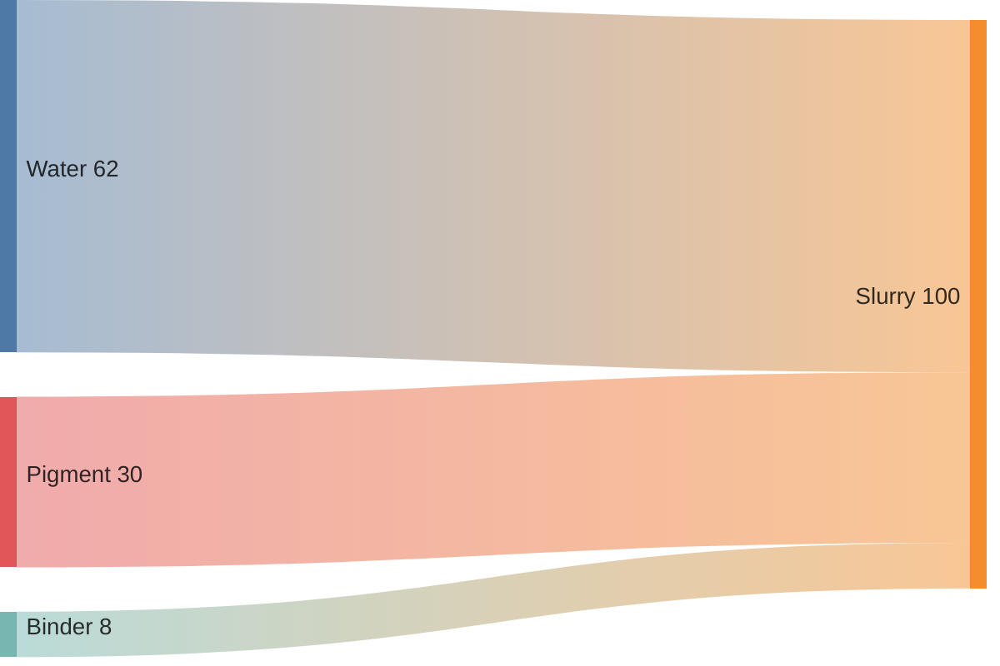

# Mermaid rendering check

Mermaid diagrams arrived from upstream Zed rather than being written for the fork: `merman` renders the source to SVG in pure Rust — no browser, no Node — and live preview opts every markdown block into it. Open this note in live preview, park the cursor here on the top lines so everything below stays rendered, and walk the checklist. Linked from [[grinding-the-ink]].

- [ ] Section 1 replaces the fence with a drawn diagram
- [ ] Section 2 offers Preview/Code tabs, a copy button, and reveals source under the cursor
- [ ] Section 3 zooms on cmd-scroll and scrolls a too-wide diagram sideways
- [ ] Section 4 honors the `mermaid 150` scale suffix
- [ ] Section 5 renders a tilde-fenced diagram
- [ ] Section 6 recolors diagrams when the theme changes
- [ ] Section 7 renders CJK entity and attribute names without crashing
- [ ] Section 8 renders each of the supported diagram families
- [ ] Section 9 renders a diagram nested inside a callout
- [ ] Section 10 leaves unsupported diagram types as plain code blocks
- [ ] Section 11 leaves near-miss fences and prose alone
- [ ] Section 12 shows unparseable mermaid as source, never as a blank

## 1. A fence becomes a diagram

The whole feature in one check — this fence should not look like a code block at all:



**Broken:** a syntax-highlighted `flowchart TD` code block, or an empty gap where the diagram should be.
**Fixed:** boxes, arrows, and edge labels, drawn in the editor's own colors.

A diagram renders on a background task, so a very complex one may show a pulsing placeholder for a beat on first paint. That is expected; a placeholder that never resolves is not.

## 2. Tabs, copy, and source reveal

Hover the diagram above. A **Preview** / **Code** tab pair sits above it and a copy button appears in its top-right corner; the copy button yields the mermaid source, not an image. Click **Code** to read the source without leaving the widget, then **Preview** to go back.

Now put the cursor inside the fence. The block should reveal its raw source for editing the way any other fenced block does — and re-render once the cursor leaves. Edit an arrow and watch it redraw.

**Broken:** the diagram stays frozen while you edit it, or the fence never comes back after the cursor leaves.
**Fixed:** source under the cursor, diagram everywhere else.

Diagrams also render inside callouts (section 9) and inside `![[note]]` transclusions, which share this code path — transclusion itself is checked in [[embed-rendering-check]].

## 3. Zoom and horizontal scroll

Zoom is **cmd-scroll** (or ctrl-scroll), deliberately, so an ordinary scroll still moves the document. Each wheel notch is 10%, the ceiling is 200%, and a level within 5% of 100% snaps back to exactly 100%. While zoomed away from 100% a `Zoom NNN%` readout with a reset button joins the copy button.

This one is wider than the note, so it should also scroll sideways inside its own box rather than being squashed to fit or pushing the note into a horizontal scroll:



**Broken:** the diagram is squashed illegibly, plain scroll zooms it, or the reset button never appears.
**Fixed:** legible at natural size, sideways-scrollable, cmd-scroll zooms in 10% steps and snaps home.

## 4. The scale suffix

The info string takes an optional percentage — `mermaid 150` — clamped to 10–500. This is a Zed extension; Obsidian has nothing like it. The same diagram at 150% should be visibly larger than the one in section 1, and the suffix itself must not stop it rendering:



## 5. Tilde fences

Tilde fences are legal CommonMark and used to be missed. This must render exactly like a backtick fence:

~~~mermaid
sequenceDiagram
    participant Hand
    participant Brush
    participant Stone
    Hand->>Stone: add three drops
    Hand->>Stone: circle slowly
    Stone-->>Hand: slurry darkens
    Hand->>Brush: load
    Brush-->>Hand: ready
~~~

## 6. Theme awareness

Diagrams are recolored from the editor's own palette rather than mermaid's defaults, and the cache is invalidated on theme change. Switch to a light theme and back to a dark one with `theme selector: toggle`, then look at every diagram in this note.

**Broken:** diagrams keep their old colors, go blank, or end up dark text on a dark fill after the switch.
**Fixed:** every diagram redraws in the new theme, with text readable against its fill in both.

## 7. Multibyte names

ER diagrams once crashed the lexer when an attribute token began with a multibyte character, which is exactly what a note about 硯 will do:



**Broken:** a panic, or the diagram falling back to source.
**Fixed:** two entity boxes with their CJK field names intact.

## 8. The supported families

Fifteen diagram types are allowlisted. These three are the ones whose styling is easiest to get wrong, so they are worth an eye each — check that no label is the same color as the shape behind it:







## 9. A diagram inside a callout

A callout body is markdown too, so a diagram nested in one must render rather than degrade to source:

> [!tip] The four-minute rule
> Density saturates near $t^* \approx 4$ min, which is roughly where the hand stops feeling grit:
>
> ```mermaid
> flowchart LR
>     T0[0 min] --> T2[2 min] --> T4[4 min] --> T6[6 min: no gain]
> ```
>
> See [[inkstone-care]] for what the hand is actually feeling.

**Broken:** the callout renders but its diagram stays a code block, or the diagram breaks the callout back into a plain block quote.
**Fixed:** a tinted callout card with a drawn diagram inside it.

## 10. Unsupported types stay code blocks

Not every type `merman` can draw is turned on: Zed allowlists fifteen and skips the rest until the CSS guarantees readable text. Both of these must render as ordinary syntax-highlighted code blocks — this is the documented gap, not a regression:





**Broken:** an empty gap, a crash, or a diagram drawn with unreadable text.
**Fixed:** plain code blocks, source fully visible.

If either type is switched on upstream, move it to section 8 rather than deleting the check.

## 11. Near misses

Detection keys on the fence's info string, so all of these must stay exactly as typed. A code block that merely mentions mermaid:

```text
mermaid diagrams are described here in prose,
including the word flowchart, which is not a fence.
```

A different language whose body looks diagram-ish:

```rust
// flowchart TD is just a comment
let graph = vec![("Dry stone", "Grind slowly")];
```

And inline prose: the word mermaid, a `mermaid` code span, and a `flowchart TD` span are all ordinary text.

One more, by hand: delete the closing fence line of section 1's diagram. An unterminated fence must not render as a diagram — only a closed one does. Undo when you are done.

## 12. Broken source degrades to source

Unparseable mermaid must leave something on screen to fix:

```mermaid
flowchart TD
    A[Unclosed bracket --> B
    B -->|missing arrow C
```

**Broken:** a blank block, a stuck loading placeholder, or a crash.
**Fixed:** the raw source, readable and editable.
