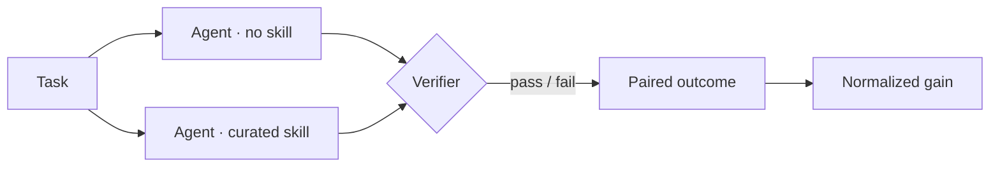

# Study design

Each task runs twice under matched conditions — once bare, once with the curated skill loaded — and the same deterministic verifier scores both runs.

The paired design is what lets a small effect show up at all: the task's own difficulty cancels out, so what remains is the skill.

## Open questions

- Does a skill written by the agent itself help as much as a curated one?
- Where does the gain go when the skill bundle grows past three modules?
